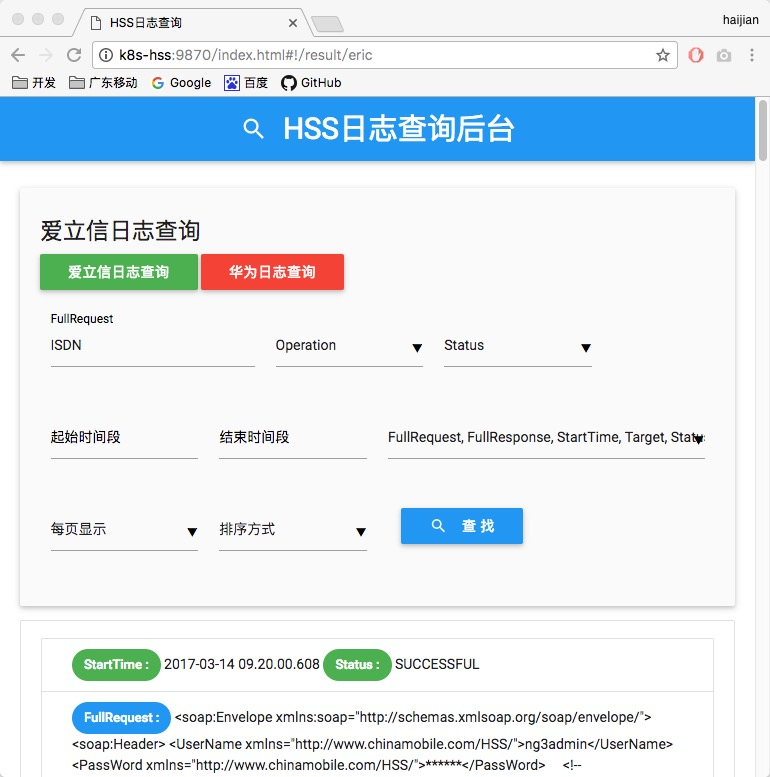
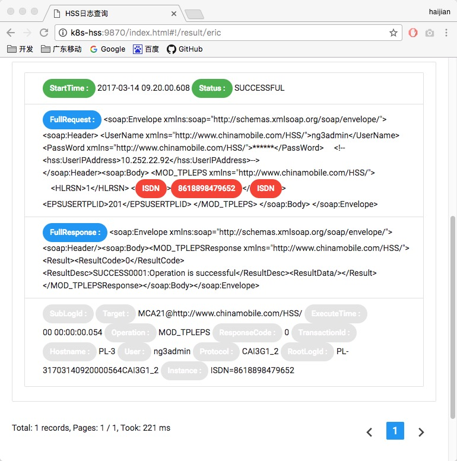

HSS-Collector
========
- 基于Akka Stream2.4.17以及Redis和Kafka-0.10.1.1、elasticsearch5.2.0的ftp日志文件采集和记录入库集群

### ListFileWorker
- 获取目录下的文件列表,并且把新的文件列表写入到redis以及kafka

### GetFileWorker: 支持同时多个运行
- 从kafka读取文件列表,并把文件ftp下载下来,入库到elasticsearch中

### 启动相关依赖服务，zookeeper，kafka，elasticsearch，redis
```sh
cd /Volumes/Share/Scala_program/HssCollector

#启动redis-server
redis-server &

#启动zookeeper
zkServer.sh start
sleep 5
zkServer.sh status
sleep 5

#启动kafka
kafka-server-start.sh /Volumes/Share/hadoop/kafka-0.10.1.1/config/server-0.properties &

#启动elasticsearch
elasticsearch -d -Ecluster.name=es-cluster
sleep 10
curl localhost:9200
```

### 启动listfile。listfile用于获取ftp目录下的文件清单，并且把新的文件清单写入redis和kafka（可以启动多个）
```sh
java -classpath "hss-lib/*" cmgd.zenghj.hss.AppListFile
```

### 启动getfile。getfile用于从kafka读取文件清单，获取ftp文件，并且把文件写入到es（可以启动多个）

```sh
java -classpath "hss-lib/*" cmgd.zenghj.hss.AppGetFile
```

### 启动restful服务。restful为日志查询界面

```sh
java -classpath "hss-lib/*" cmgd.zenghj.hss.HssRestful
```
- 浏览器访问
```sh
http://localhost:9870
```

### 异常恢复说明:
- 请关闭所有listfile、getfile节点，并重新启动listfile、getfile
- listfile启动的时候会检查redis是否有处理中的文件记录，如果有，那么会把文件名记录重新写入到kafka中
- 启动getfile之后不要启动listfile，否则会出现文件重复处理


### 删除并重置所有数据

```sh
# 清除redis数据
echo 'keys *' | redis-cli
echo 'flushall' | redis-cli 

# 清除kafka数据
kafka-topics.sh --zookeeper localhost:2181 --list
kafka-topics.sh --zookeeper localhost:2181 --delete --topic hss-files-topic

# 清除elasticsearch数据
http DELETE localhost:9200/hss
```

### 界面截图



---

